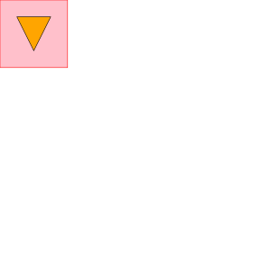
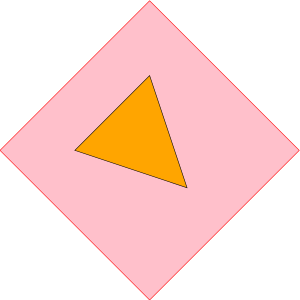

# affinefit

> Fit an affine transformation to given points

[](https://www.npmjs.com/package/affinefit/)

## Table of Contents

<!-- !toc (minlevel=2 omit="Table of Contents") -->

* [Description](#description)
  * [Usage](#usage)
  * [Example](#example)
* [Contribution and License Agreement](#contribution-and-license-agreement)
* [License](#license)
* [References](#references)

<!-- toc! -->

## Description

Fit an affine transformation to given points

This module finds, by least squares fitting, an affine transformation that (approximately) transforms given set of points/vertices/vector to another. It works with arbitrary dimensional points and requires at least dim points, when your points are dim-dimensional.

The original algorithm from Jarno Elonen <elonen@iki.fi> was translated from python to javascript and can be found at [python affine-fit][].

### Usage

```js
var affineFit = require('affinefit')

var res
var fromPts = [[1, 1], [1, 2], [2, 2], [2, 1]]   // a 1x1 rectangle
var toPts   = [[4, 4], [6, 6], [8, 4], [6, 2]]   // scaled x 2, rotated 45 degrees and translated

var trn = affineFit(fromPts, toPts)

res = trn([1, 2])
//> [ 5.999999999999998, 5.999999999999999 ]
res = trn([1.5, 1.5])
//> [ 6, 4 ]
```

### Example

Run the example from `./test/example.js` which transforms the given svg image




using the transform

`[[1, 1], [1, 2], [2, 2], [2, 1]] => [[4, 4], [6, 6], [8, 4], [6, 2]]`

## Contribution and License Agreement

If you contribute code to this project, you are implicitly allowing your
code to be distributed under the CC0 1.0 license. You are also implicitly
verifying that all code is your original work or correctly attributed
with the source of its origin and licence.

## License

CC0 1.0 Universal Public Domain Dedication

See [LICENSE][] for more info.

## References

<!-- !ref -->

* [LICENSE][LICENSE]
* [python affine-fit][python affine-fit]

<!-- ref! -->

[LICENSE]: ./LICENSE
[python affine-fit]: http://elonen.iki.fi/code/misc-notes/affine-fit/
